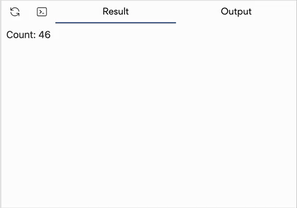

# 1 概述

## 什么是 SolidJS？SolidStart？

> 官网：[SolidJS · Reactive Javascript Library (redwoodjs.cn)](https://solid.redwoodjs.cn/)

前端使用技术 SolidJS，这是 SolidJS 在 Github 上的组织：[SolidJS (github.com)](https://github.com/solidjs)，其中有几个主要的仓库：

- solid：[solidjs/solid: A declarative, efficient, and flexible JavaScript library for building user interfaces. (github.com)](https://github.com/solidjs/solid)
- Solid-router：[solidjs/solid-router: A universal router for Solid inspired by Ember and React Router (github.com)](https://github.com/solidjs/solid-router)
- solid-start：[solidjs/solid-start: SolidStart, the Solid app framework (github.com)](https://github.com/solidjs/solid-start)

首先需要理解 solid、solid-router、solid-start 的区别：

solid 是响应库本身，solid-router 提供了路由功能，而 solid-start 像是整合了一系列技术的完整框架。

solid 与 solid-start 的区别就像是 svelte 和 svelte-kit 一样。

---

下面的内容是我在过 solidjs 的 Tutorial 的时候做的一些记录。

## A first glance at SolidJS

### 1. 基础

一个 Solid App 由若干个被称作 *组件* 的函数构成，下面是一个 `main.jsx` 的例子：

```jsx
import { render } from 'solid-js/web';

function HelloWorld() {
  return <div>Hello World!</div>;
}

render(() => <HelloWorld />, document.getElementById('app'))

```

`HelloWorld` 函数直接返回了一个 HTML 标签，这种 js 与 html 混写的语法被称为 *JSX*，这种函数在之后可以当作新的 HTML 标签被使用，我们也称其为 *组件*。

`render()` 函数是整个 Solid App 的入口，它会将第一个参数渲染并挂载到第二个参数指定的 HTML 元素上。

### 2. JSX

上面提到了一种全新的语法 *JSX*，它不仅仅使你能够在函数中返回 HTML 标签，还有更多的内容，再看下面的例子：

```jsx
import { render } from 'solid-js/web';

function HelloWorld() {
  const name = "Solid";
  // 下面这里使用括号只是为了把这坨 HTML 扩起来，没有特殊含义，就像 const n = (1+1) 一样
  const svg = (
    <svg height="300" width="400">
      <defs>
        <linearGradient id="gr1" x1="0%" y1="60%" x2="100%" y2="0%">
          <stop offset="5%" style="stop-color:rgb(255,255,3);stop-opacity:1" />
          <stop offset="100%" style="stop-color:rgb(255,0,0);stop-opacity:1" />
        </linearGradient>
      </defs>
      <ellipse cx="125" cy="150" rx="100" ry="60" fill="url(#gr1)" />
      Sorry but this browser does not support inline SVG.
    </svg>
  );

  return (
    <>
      <div>Hello {name}!</div>
      {svg}
    </>
  )
}

render(() => <HelloWorld />, document.getElementById('app'))

```

1. `{}` 语法

    在这个例子中，我们直接定义了字符串 `name` 以及一个 JSX 元素 `svg`。

    而在之后，我们可以在 HTML 中使用 `{name}` 对其进行引用，`{}` 语法不仅可以引用变量，还可以引用函数，其实就是嵌入了 JS 表达式。

2. JSX 必须返回一个元素（不能返回多个）

    在这个例子中我们使用 `<>` 和 `</>` 标签将返回内容包裹起来。

    这个 `<>` 被叫做 *Fragment element*（片段元素）

3. JSX 不支持 HTML 注释 `<!--...-->` 或类似 `<!DOCTYPE>` 特殊的标签

### 3. 组件

在构建应用时，你会想要将代码分解到不同的文件中来保证模块化和重用性。

在 SolidJS 中实现这样的事情十分简单，我们使用 *组件* 来分解我们的代码，而一个 *组件* 就是一个返回 JSX 的函数。

下面是一个例子：

`nested.jsx`：

```jsx
export default () => <p>This is a Paragraph</p>
```

`main.jsx`：

```jsx
import { render } from "solid-js/web";
import Nested from "./nested";

function App() {
  return (
    <>
      <h1>This is a Header</h1>
      <Nested />
    </>
  );
}

render(() => <App />, document.getElementById("app"));

```

十分的好理解～

### 4. 信号（Signal）

SolidJS 中响应式的核心概念便是 *信号（Signal）*。

一个信号包含着一个值，而当其值被改变时它会自动更新用到它的地方。

`solid-js` 中的函数 `createSignal` 可以用于创建一个信号：

```jsx
const [count, setCount] = createSignal(0);
```

`createSignal` 接受一个参数作为信号的初始值，返回值为一个长度为 2 的数组，包含两个函数，即 getter 和 setter。

使用 js 的结构语法，我们将 getter 和 setter 分别赋给 `count()` 和 `setCount()`。

下面我们使用 `setInterval` 来演示响应性：

```jsx
import { render } from "solid-js/web";
import { createSignal } from "solid-js";

function Counter() {
  const [count, setCount] = createSignal(0);

  setInterval(() => setCount(count() + 1), 1000);

  return <div>Count: {count()}</div>;
}

render(() => <Counter />, document.getElementById('app'));
```



Signal 的 setter 同样可以接受一个函数来使用前一个值设置后一个值，所以上面的第 7 行也可以这么写：

```jsx
  setInterval(() => setCount(c => c+1), 1000);
```

你也可以从一个信号计算出一个依赖于该信号的值，这被我们称为 *derived signal*：

```jsx
const doubleCount = () => count() * 2;
```

这样在 count 被更新时，doubleCount 也会被更新

### 5. 效应（Effect）

*效应（Effect）*类似于一个监听器，它会在使用的值被改变时重新执行，比如下面这个例子：

```jsx
import { render } from 'solid-js/web';
import { createSignal, createEffect } from 'solid-js';

function Counter() {
  const [count, setCount] = createSignal(0);
  createEffect(() => {
    console.log("The count is now", count());
  });

  return <button onClick={() => setCount(count() + 1)}>Click Me</button>;
}

render(() => <Counter />, document.getElementById('app'));

```

使用 `createEffect` 创建了一个 *效应（Effect）*，在其中使用了 count，因此在 *信号（Signal）*被更新时，它就会重新执行，打印当前的 count 的值。

### 6. 记忆（Memo）

对于下面这个例子：

```jsx
import { render } from 'solid-js/web';
import { createSignal, createMemo } from 'solid-js';

function fibonacci(num) {
  if (num <= 1) return 1;

  return fibonacci(num - 1) + fibonacci(num - 2);
}

function Counter() {
  const [count, setCount] = createSignal(10);
  const fib = () => fibonacci(count());

  return (
    <>
      <button onClick={() => setCount(count() + 1)}>Count: {count()}</button>
      <div>1. {fib()} {fib()} {fib()} {fib()} {fib()}</div>
      <div>2. {fib()} {fib()} {fib()} {fib()} {fib()}</div>
      <div>3. {fib()} {fib()} {fib()} {fib()} {fib()}</div>
      <div>4. {fib()} {fib()} {fib()} {fib()} {fib()}</div>
      <div>5. {fib()} {fib()} {fib()} {fib()} {fib()}</div>
      <div>6. {fib()} {fib()} {fib()} {fib()} {fib()}</div>
      <div>7. {fib()} {fib()} {fib()} {fib()} {fib()}</div>
      <div>8. {fib()} {fib()} {fib()} {fib()} {fib()}</div>
      <div>9. {fib()} {fib()} {fib()} {fib()} {fib()}</div>
      <div>10. {fib()} {fib()} {fib()} {fib()} {fib()}</div>
    </>
  );
}

render(() => <Counter />, document.getElementById('app'))

```

当 count 较大时，每一个 fib() 都需要消耗较长的时间来计算一次（虽然他们的值是相通的）。

我们可以使用 `createMemo` 来做一个“缓存”，Memo 类似于一个 效应，又类似一个只读的信号

```jsx
const fib = createMemo(() => {
console.log('Calculating Fibonacci');
return fibonacci(count());
});
```

---

上面是一些简单的内容，更多见 solidjs 的文档。

